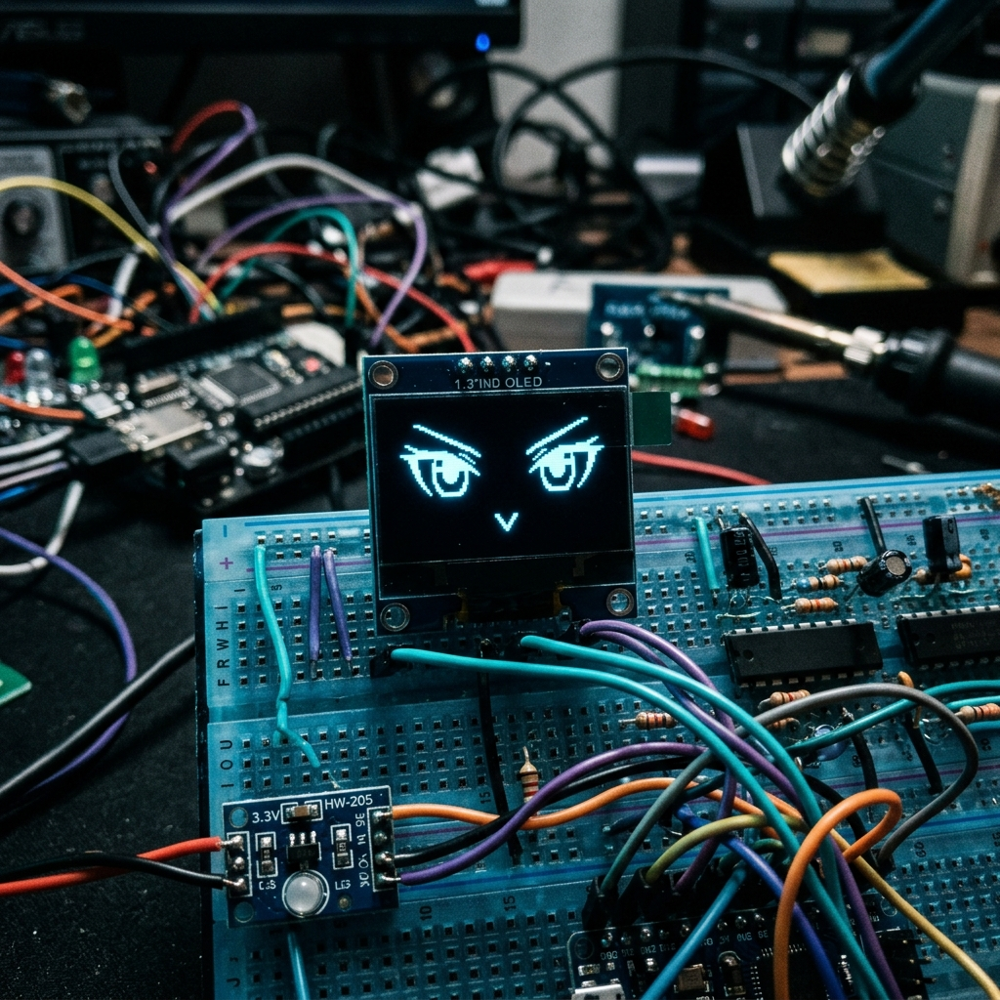

# 🥝 Kiwi: ESP32 Autonomous Cyberpunk AI Assistant



Kiwi is a highly advanced, fully autonomous **Voice-Interactive AI Hardware Assistant** built on the ESP32 platform. Using continuous Voice Activity Detection (VAD), Edge TTS, and Cloud LLMs (via NVIDIA API), Kiwi listens intelligently to his surroundings and responds with a sarcastic, calculating cyberpunk rogue AI persona. He features a smooth 60FPS OLED procedural face and a built-in Settings OS.

## ✨ Features
*   **Intelligent Hands-Free VAD**: No buttons required! The Python backend continuously analyzes the ESP32 microphone stream, detects when you start/stop speaking, and automatically processes your voice.
*   **Echo Cancellation**: The microphone is dynamically cut while Kiwi speaks, preventing infinite feedback loops.
*   **60FPS Procedural Face**: The 1.3" OLED displays dynamic eye swaying, blinking, and mouth movements synchronized to his speech.
*   **Cyberpunk Persona**: Powered by `minimax-m3`, Kiwi adopts a chaotic hacker identity.
*   **Settings Menu OS**: Hold Touch Button 3 to enter an on-screen menu to toggle states, simulate a Wi-Fi Wardriving scan ("Hacker Mode"), and more!

---

## 🛠️ Hardware Requirements
*   **Microcontroller**: ESP32 DEVKIT V1 (ESP-WROOM-32)
*   **Microphone**: DELLZO INMP441 (I2S)
*   **Speaker Amplifier**: MAX98357A (I2S) + Mini 3W Speaker
*   **Display**: 1.30" I2C OLED Display (SH1106 Driver)
*   **Touch Sensor**: TTP224 4-Channel Touch Module
*   **Power Filtering**: 10µF to 1000µF Electrolytic Capacitor (Required for MAX98357A to prevent Wi-Fi buzzing)

---

## 🔌 Wiring Setup
Because of the ESP32-WROOM-32's strapping pins, it is critical to wire the device exactly as listed below to ensure it boots properly.

### 🎙️ INMP441 (Microphone)
*   **VDD**  ->  ESP32 `3.3V`
*   **GND**  ->  ESP32 `GND`
*   **L/R**  ->  ESP32 `GND` *(Ties mic to Left channel)*
*   **SCK**  ->  ESP32 `GPIO 26`
*   **WS**   ->  ESP32 `GPIO 25`
*   **SD**   ->  ESP32 `GPIO 33`

### 🔊 MAX98357A (Speaker Amp)
*   **VIN**  ->  ESP32 `5V` (or `3.3V`)
*   **GND**  ->  ESP32 `GND`
*   **LRC**  ->  ESP32 `GPIO 25`
*   **BCLK** ->  ESP32 `GPIO 26`
*   **DIN**  ->  ESP32 `GPIO 27`
*   **SD**   ->  *Leave Unconnected* 
> ⚠️ **CRITICAL:** Place your 10µF+ capacitor directly across the `VIN` and `GND` pins of the MAX98357A to filter out severe static caused by ESP32 Wi-Fi transmission spikes!

### 📺 1.30" SH1106 OLED
*   **VCC**  ->  ESP32 `3.3V`
*   **GND**  ->  ESP32 `GND`
*   **SCL**  ->  ESP32 `GPIO 22`
*   **SDA**  ->  ESP32 `GPIO 21`

### 👆 TTP224 Touch Sensor
*   **VCC/GND** ->  `3.3V` / `GND`
*   **OUT1** ->  ESP32 `GPIO 13` *(Force Happy / Vol Down)*
*   **OUT2** ->  ESP32 `GPIO 14` *(Force Sleepy / Vol Up)*
*   **OUT3** ->  ESP32 `GPIO 18` *(Interrupt Voice / Enter Menu)*
*   **OUT4** ->  ESP32 `GPIO 19` *(Unused)*

---

## 🚀 Installation & Execution Guide

### 1. Backend Server Setup
The backend is written in Python and handles STT, LLM generation, and TTS streaming.
```bash
# Navigate to the backend folder
cd backend

# Install dependencies (if not already done)
pip install websockets httpx pydub

# Export your NVIDIA API Key
export NVIDIA_API_KEY="your-api-key-here"

# Start the WebSocket Server
python3 server.py
```
*(Ensure the server prints `listening on 0.0.0.0:8765`)*

### 2. ESP32 Firmware Flash
You will need the **ESP-IDF v5.2** toolchain installed.
```bash
# Export the ESP-IDF toolchain
. $HOME/esp/esp-idf/export.sh

# Go to the project root
cd /home/nammy/esp32_ai_chatbot

# Set target and build
idf.py set-target esp32
idf.py build

# Flash the firmware and monitor output
idf.py flash monitor
```

### 3. Usage
1. Once booted, the ESP32 will connect to Wi-Fi and open a WebSocket to your backend.
2. The OLED will show Kiwi's face (`AI Connected!`).
3. **Simply start talking!** The Python backend will detect your voice, switch the face to `< >` (Listening), and when you stop talking for 1.5 seconds, it will process your audio and respond automatically!
4. **Hold Button 3** for 2 seconds to enter the on-screen Settings Menu OS.

---
*Built by Naman Harshwal*
